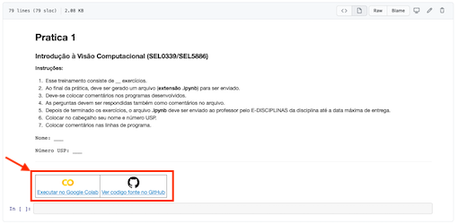
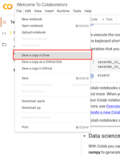
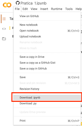

  
 ## Visão Computacional (SEL0339/SEL5886 - 2022)
 
 Faremos uso desse repositório do Github para disponibilizarmos as listas de exercício e vamos utilizar o Google Colab para a execução das mesmas. As práticas devem ser feitas individualmente e enviadas para o professor por meio do E-disciplinas. **Não será contabilizada nota para os alunos que não enviarem os exercícios**. 

### Instruções gerais:

 - O link para as listas de exercício estão localizadas no [final dessa página](https://github.com/LAVI-USP/SEL0339-SEL5886_2022#listas-de-exercício).
 - O [Google Colab](https://colab.research.google.com/notebooks/intro.ipynb) é uma ferramenta que permite escrever e executar códigos Python no seu navegador sem a necessidade de instalar nada. O Colab nada mais é do que um [Jupyter notebook](https://jupyter.org) hospedado pelo Google.
 - As instruções específicas de cada exercício se encontram no jupyter notebook de cada prática.
 - [Aqui](/extra) você pode encontrar a indicação de cursos, tutoriais, etc, sobre python, jupyter notebook, bibliotecas utilizadas e etc.
 - Todas as listas são individuais.
 - Ao detectarmos plágio, os alunos envolvidos serão penalizados.
 - Ao final de cada prática, os arquivos devem ser enviados através do E-disciplinas.
 - O aluno que não enviar o exercício não obterá nota referente ao mesmo.
 - Quaisquer problemas na execução das práticas, entrar em contato com os monitores.
 
### Instruções para abrir os códigos no Google Colab:
 
1. Abrir a lista de exercício no Colab através do botão no topo de cada exercício.  

2.  Fazer o login com o e-mail da USP ou do Gmail.

3.  **Salvar uma cópia do notebook no Google Drive**. 

4. Execute os exercícios.

5. Faça o download do Jupyter notebook e envie para o professor pelo sistema E-Disciplinas.

6. O Colab salva periodicamente as alterações do seu código, porém, qualquer arquivo localizado no diretório deles será **apagado** ao desconectar-se da plataforma.

### Listas de Exercício

 - [Lista de Exercício 1](praticas/Lista_de_Exercicio_1.ipynb)
 - [Lista de Exercício 2](praticas/Lista_de_Exercicio_2.ipynb)
 - [Lista de Exercício 3](praticas/Lista_de_Exercicio_3.ipynb)
 - [Lista de Exercício 4](praticas/Lista_de_Exercicio_4.ipynb)
 - [Lista de Exercício 5](praticas/Lista_de_Exercicio_5.ipynb)
 - [Lista de Exercício 6](praticas/Lista_de_Exercicio_6.ipynb)
 - [Lista de Exercício 7](praticas/Lista_de_Exercicio_7.ipynb)
---

Laboratory of Computer Vision ([Lavi](http://iris.sel.eesc.usp.br/lavi/))  
Department of Electrical and Computer Engineering  
São Carlos School of Engineering, University of São Paulo  
São Carlos - Brazil
